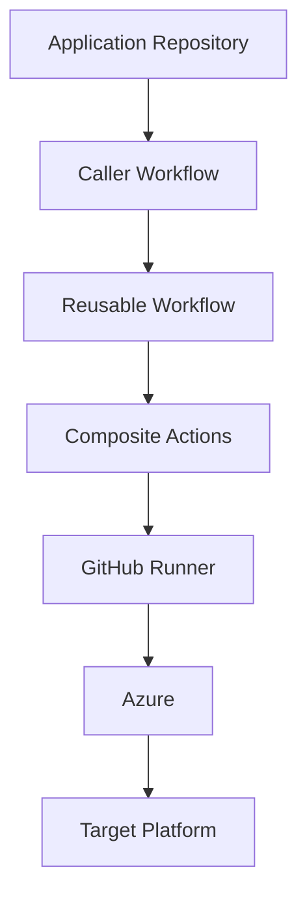
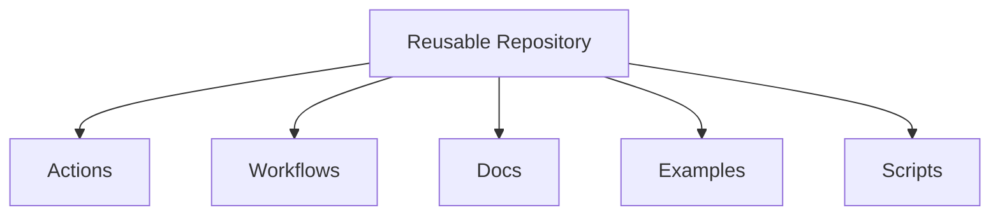
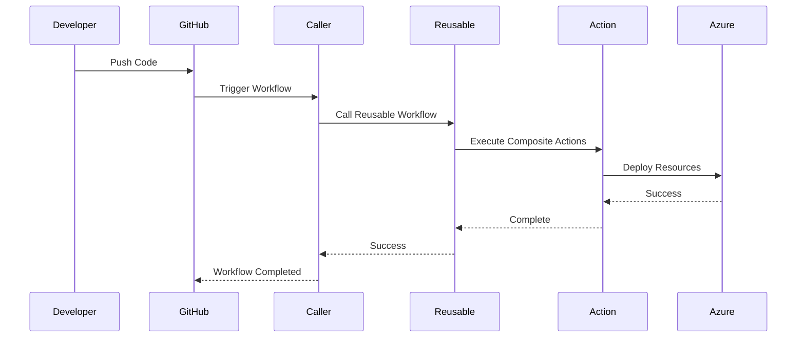

# AWL GitHub Enterprise Reusable Workflows

# 02 - Architecture

---

# Architecture Overview

The AWL GitHub Enterprise Reusable Workflows platform follows a layered architecture that separates application pipelines, reusable workflows, composite actions, and cloud services.

This design minimizes duplicated pipeline code while providing a standardized deployment framework across all application repositories.

---

# High-Level Architecture



---

# Platform Layers

The platform consists of five logical layers.

## Layer 1

Application Repository

Contains:

- Application Source Code
- Minimal GitHub Workflow
- Configuration Files

Responsibilities:

- Build Trigger
- Deployment Trigger
- Environment Selection

---

## Layer 2

Reusable Workflow Repository

Contains:

- Build Workflows
- Deployment Workflows
- Common Workflows

Responsibilities:

- CI/CD orchestration
- Standardization
- Workflow governance

---

## Layer 3

Composite Actions

Contains reusable automation modules such as:

- Runtime setup
- Azure Login
- Upload Artifact
- Download Artifact
- Health Check
- Deployment Summary
- Deployment Actions

Responsibilities:

- Modular execution
- Code reuse
- Reduced workflow complexity

---

## Layer 4

GitHub Runner

Supported runners:

- GitHub Hosted
- Self Hosted

Responsibilities:

- Execute workflows
- Build applications
- Deploy applications

---

## Layer 5

Deployment Platform

Supported targets include:

- Azure App Service
- Azure Functions
- IIS
- Linux Virtual Machine
- Azure Kubernetes Service
- Firebase
- Power BI

---

# Repository Architecture



---

# Workflow Execution Flow



---

# Build Architecture

```mermaid
flowchart LR

Checkout

-->

Setup Runtime

-->

Restore Dependencies

-->

Build

-->

Publish

-->

Upload Artifact
```

---

# Deployment Architecture

```mermaid
flowchart LR

Download Artifact

-->

Azure Login

-->

Deploy

-->

Health Check

-->

Deployment Summary
```

---

# Authentication Architecture

Azure authentication is implemented using OpenID Connect (OIDC).

```mermaid
flowchart LR

GitHub

-->

OIDC Token

-->

Microsoft Entra ID

-->

Azure Subscription
```

Advantages:

- No client secret
- Short-lived token
- Secure authentication
- Microsoft recommended approach

---

# Artifact Flow

```mermaid
flowchart LR

Build Workflow

-->

Artifact

-->

GitHub Artifacts

-->

Deploy Workflow

-->

Target Environment
```

---

# Consumer Repository Interaction

```mermaid
flowchart TD

Application Repo

-->

build.yml

-->

Reusable Build Workflow

-->

Composite Actions

-->

Artifacts

-->

deploy.yml

-->

Reusable Deploy Workflow

-->

Azure
```

---

# Design Principles

The platform is based on the following principles.

- Reusability
- Modularity
- Security
- Scalability
- Maintainability
- Standardization
- Technology Independence

---

# Benefits

- Reduced duplicated code
- Consistent CI/CD implementation
- Easier maintenance
- Centralized automation
- Enterprise governance
- Simplified onboarding
- Improved security

---

# Version

Current Version

**v1.0.0**