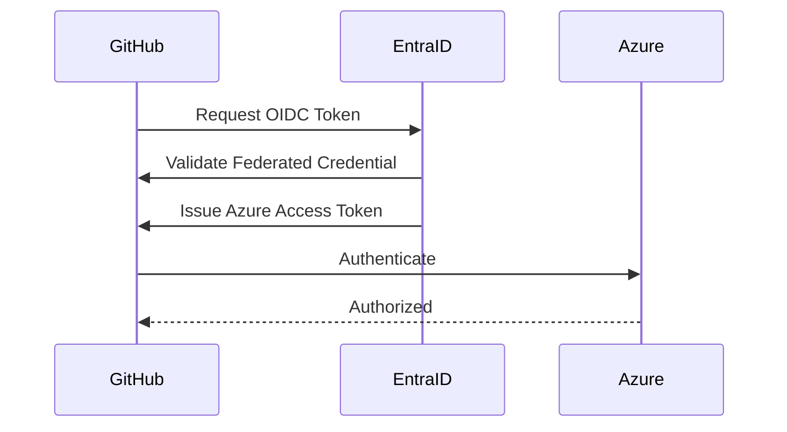

# AWL GitHub Enterprise Reusable Workflows

# 07 - Azure Authentication using OpenID Connect (OIDC)

---

# Overview

The AWL GitHub Enterprise Reusable Workflows repository authenticates with Azure using **OpenID Connect (OIDC)**.

OIDC enables GitHub Actions to authenticate to Microsoft Entra ID without storing long-lived client secrets.

This is the Microsoft recommended authentication mechanism for GitHub Actions.

---

# Benefits

Compared to Service Principal Client Secrets, OIDC provides:

- Secretless authentication
- Short-lived access tokens
- Reduced credential management
- Improved security posture
- Automatic token rotation
- Better compliance
- Microsoft recommended authentication model

---

# Authentication Architecture

```mermaid
flowchart LR

Developer

-->

GitHub Actions

-->

GitHub OIDC Token

-->

Microsoft Entra ID

-->

Azure Access Token

-->

Azure Subscription
```

---

# Authentication Flow



---

# Components

The authentication model consists of:

- GitHub Repository
- GitHub Environment
- GitHub OIDC Token
- Microsoft Entra ID Application
- Federated Credential
- Azure Role Assignment

---

# Azure Configuration

The following Azure resources must be configured.

## Microsoft Entra ID

Create an App Registration.

Required information:

- Application Name
- Client ID
- Tenant ID

---

## Federated Credential

Configure a Federated Credential for GitHub.

Typical values:

Subject

```
repo:organization/repository:environment:PROD
```

Issuer

```
https://token.actions.githubusercontent.com
```

Audience

```
api://AzureADTokenExchange
```

---

## Azure Role Assignment

Assign the required Azure role.

Examples

- Contributor
- Website Contributor
- Storage Blob Data Contributor
- Azure Kubernetes Service RBAC Cluster Admin

Follow the principle of least privilege.

---

# GitHub Configuration

GitHub repository requires the following secrets.

| Secret | Description |
|---------|-------------|
| AZURE_CLIENT_ID | Application (Client) ID |
| AZURE_TENANT_ID | Microsoft Entra Tenant ID |
| AZURE_SUBSCRIPTION_ID | Azure Subscription ID |

No Client Secret is required.

---

# GitHub Permissions

Reusable workflows must request the following permissions.

```yaml
permissions:

  id-token: write

  contents: read
```

---

# Azure Login

Authentication is performed using the reusable composite action.

```
awl-azure-login
```

Example

```yaml
- name: Azure Login

  uses: ./.github/actions/awl-azure-login

  with:

    client-id: ${{ secrets.AZURE_CLIENT_ID }}

    tenant-id: ${{ secrets.AZURE_TENANT_ID }}

    subscription-id: ${{ secrets.AZURE_SUBSCRIPTION_ID }}
```

---

# Supported Deployment Targets

OIDC authentication is currently supported for:

- Azure App Service
- Azure Functions
- Azure Kubernetes Service (AKS)

Future Azure services may also adopt the same authentication model.

---

# Security Best Practices

- Use GitHub Environments.
- Grant minimum Azure RBAC permissions.
- Use one App Registration per environment where practical.
- Avoid Owner role assignments.
- Review Federated Credentials regularly.
- Disable unused App Registrations.
- Rotate application ownership as required by organizational policy.

---

# Troubleshooting

## Error

```
AADSTS70025
```

Possible Cause

Federated Credential not configured correctly.

---

## Error

```
Login failed
```

Possible Cause

Incorrect Client ID, Tenant ID, or Subscription ID.

---

## Error

```
Insufficient privileges
```

Possible Cause

Missing Azure RBAC role assignment.

---

## Error

```
No federated identity credential found
```

Possible Cause

Subject claim does not match the GitHub repository or environment.

---

# Frequently Asked Questions

## Is a Client Secret required?

No.

---

## Can OIDC be used with self-hosted runners?

Yes.

---

## Can multiple repositories share the same App Registration?

Yes.

However, separate App Registrations per environment or business unit may simplify governance and auditing.

---

## Does OIDC work with GitHub Enterprise?

Yes.

OIDC is fully supported with GitHub Enterprise Cloud.

---

# References

- Microsoft Entra ID
- GitHub Actions OIDC
- Azure Login Action Documentation

---

# Version

Current Version

**v1.0.0**